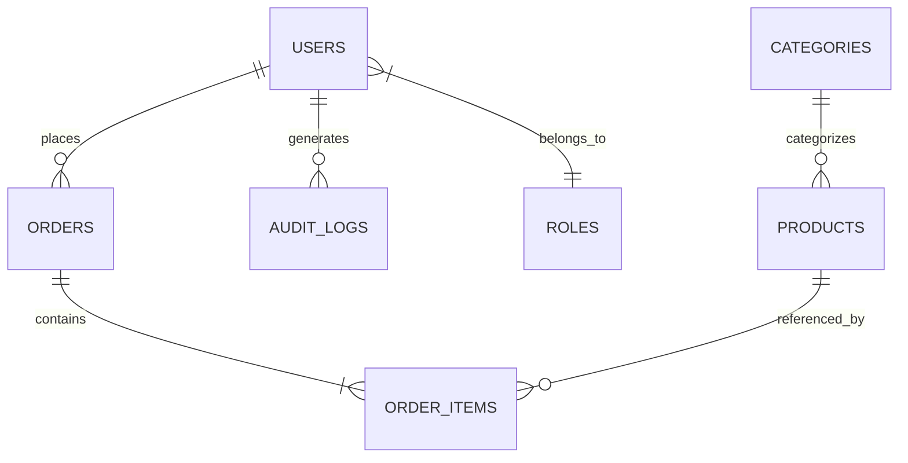

# Database Entity-Relationship Diagram (ERD) Specification

```mermaid
erDiagram
    USERS ||--o{ ORDERS : places
    USERS ||--o{ AUDIT_LOGS : generates
    USERS }|--|| ROLES : belongs_to
    ORDERS ||--|{ ORDER_ITEMS : contains
    PRODUCTS ||--o{ ORDER_ITEMS : referenced_by
    CATEGORIES ||--o{ PRODUCTS : categorizes
```
